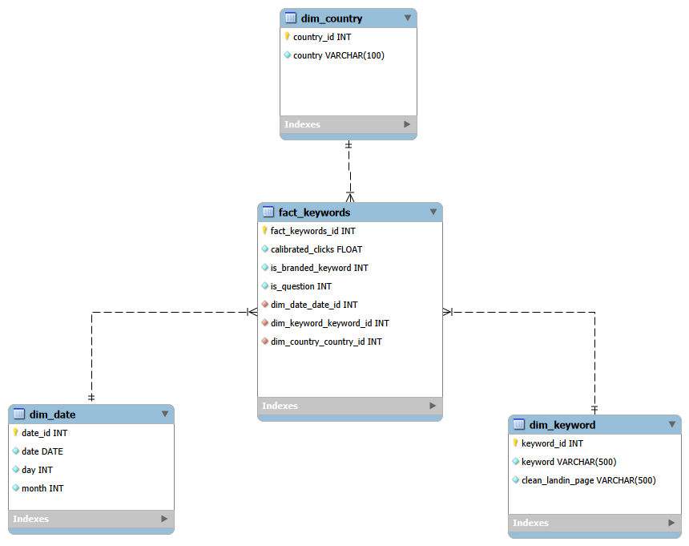

# ELT proces datasetu Google keywords search
Tento repozitár slúži na zaznamenanie procesu spracovania a analýzy datasetu s názvom Google keywords search dataset, obsahuje obrázkovú textovú a kódovú dokumentáciu celého ELT procesu spracovania a implementácie a vytvorenia dátového skladu STAR schémy. **Dataset a ELT spracovanie sa zameriava na prácu s vyhľadávaním používateľov z krajín celého sveta, dané dáta sa dajú použiť na následnú predikciu vyhľadávaní a prispôsobenia náľho biznis modelu, taktiež za účeľmi výskumu.** 

Výsledný dátový model umožňuje multidimenzionálnu analýzu a vizualizáciu kľúčových metrik.

---

## 1.  Úvod a popis zdrojových dát/odôvodnenie výberu

### 1.1 Charakteristika datasetu
Táto práca sa zameriava na analýzu datasetu Google Keywords Search, ktorý obsahuje údaje o vyhľadávaní kľúčových slov vo vyhľadávači Google, obsahuje taktiež krajinu vyhľadávača. Dataset poskytuje prehľad o správaní používateľov na internete a umožňuje analyzovať dopyt po konkrétnych témach, produktoch alebo službách na základe reálnych vyhľadávacích dotazov.

### 1.2 Voľba datasetu
- použitie v oblasti marketingu a predaja
- vysoká praktickosť
- údaje pochádzajú priamu z Google(najpoužívanejší search engine na svete)
- identifikácia trendov

### 1.3 Podporovaný biznis proces
- analyzované dáta podporujú najmä biznis procesy súvisiace s online marketingom
- je možné efektívne plánovať reklamné kampane
- optimalizovať obsah webových stránok
- rozhodovať o výbere najvhodnejších kľúčových slov

#### Zdrojové dáta pochádzajú z snowflake marketplace datasetu dostupného [tu](https://app.snowflake.com/marketplace/listing/GZT1ZA3NJP/similarweb-ltd-google-keywords-search-dataset-discover-all-searches-on-google?search=GOOGLE%20KEYWO)
#### Dataset obsahuje jednu hlavnú tabuľku GOOGLE KEYWORDS:
- CALIBRATED_CLICKS
- CALIBRATED_USERS
- CLEAN_LANDINGPAGE
- COUNTRY
- DATE
- DAY
- IS_BRANDED_KEYWORD
- IS_QUESTION
- KEYWORD
- MONTH

### 1.4 Dátová architektúra
#### ERD diagram
Surové dáta sú usporiadané v relačnom modeli, ktorý je znázornený na entitno-relačnom diagrame:

<p align="center">
  
</p>

<p align="center"><em>Obrázok 1 Entitno-relačná schéma Google Keywords</em></p>

#### Očíslovanie krajín
Z dôvodu číselných označení krajín vo vybranej databáze sme vytvorili csv súbor obsahujúci číselný kód každej krajiny, je potrebné ho nahrať pre plnú funkčnosť 
[Stiahni súbor tu](csv/nazvykrajin.csv)

---
# 2. Dimenzionálny model
V ukážke máme navrhnutú schému hviezdy podľa Kimballovej metodológie.Obsahuje 1 tabuľku faktov fact_keywords, ktorá je prepojená s nasledujúcimi 3 dimenziami:
- dim_date: obsahuje date,day a month. Ide o časové údaje o vyhľadávaní
- dim_country: obsahuje id a krajinu
- dim_keyword: obsahuje kľúčové slovo vyhľadania a landing page vyhľadávania

Štruktúra hviezdicového modelu je znázornená na diagrame nižšie.

<p align="center">
  
</p>

<p align="center"><em>Obrázok 2 Schéma hviezdy pre Google keywords</em></p>


```


